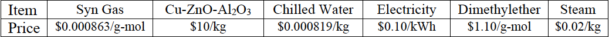

# OPTIMIZATION OF SYNGAS TO DME REACTION
- - -

ASPEN Plus was used to develop the process scheme shown below to simulate the conversion of synthesis gas to dimethylether via the following vapor-phase reactions over a Cu-ZnO-Al2O3 catalyst using the PSRK (Peng-Robinson-Soave-Redlich-Kwong) Properties Method. An investment analysis was also done on the plant to determine the ROI.
- - -

- - -
## PROBLEM SPECIFICS
- - -

Syn gas containing carbon monoxide and hydrogen in a molar ratio of 1:2 at 25oC and 7 atm
(sream S1) is fed at a molar flow rate of 1,200 kmol/h to a two-stage compressor (B1-B2-B3) that has an intercooler provision (B2) and an isentropic compression efficiency of 72% and 100% mechanical efficiency at both stages (B1 & B3). After leaving the first stage (B1) at a pressure Pint that is to be determined, the compressed syn gas (stream S2) is cooled by a pressurized water stream (S12) to a temperature of 80oC before entering the second stage. The heat exchange between cooling water and syn gas is characterized by a countercurrent exchange (B2) with an overall heat transfer coefficient of 200 kcal/(h.m2.K). In the second stage (B3), the pressure of the syn gas is raised to 50 atm. The pressure Pint is to be determined that minimizes the overall power requirement of the two-stage compressor.

Started off with an analysis assuming that after leaving the two-stage compressor, the
compressed syn gas enters directly into water-cooled, packed-bed reactor (B5) where the vaporphase reactions 1 and 2, occur over a Cu-ZnO-Al2O3 catalyst at 250oC and 50 atm. The rate expressions for Reactions 1 and 2 are given below.
- - -

- - -

Also the rate basis is catalyst weight, not reactor volume (as implied by the presence of kg in the units for the reaction rate and rate constants). The reactor is a tubular reactor with the Cu-ZnO-Al2O3 catalyst packed in a bundle of 500 stainless steel tubings with a bed voidage of 0.39 and a catalyst particle density of 1.3 kg/L. Each tubing has a 0.0762-m diameter and a length expected to be within the 2.0−10.0 m range, which was to be determined to achieve a (83 ± 0.05)% consumption of carbon monoxide in the preliminary analysis. The heat duty of the reactor (Q2) is taken up by the cooling water stream leaving the two-stage compressor (stream S13). The reaction mixture is fed to a water-cooled partial condenser (B6-B8) operating at 50 atm and 10oC. Cooling at the partial condenser (B6) is provided by chilled water entering the partial condenser at 5oC and 20 atm. The mass flow rate of the chilled water (> 60,000 kg/h) was also to be determined. After taking up the heat duty Q1 at the partial condenser (B6), the chilled water stream (S12) goes to the two-stage compressor to cool the compressed syn gas stream S2. It was desired to determine the molar flow rates of the various species in the vapor and liquid fractions (S7 and S8, respectively) leaving the partial condenser.

Following a determination of the required length of each of the reactor tubings, a mixer (B4) was inserted between the two-stage compressor and the packed-bed catalytic reactor, and stream S7 from Block B6 was recycled and combined with the compressor effluent (S4) and the resulting combined stream (S5) entered the catalytic reactor. Upon addition of the mixer B4 to the flowsheet and turning stream S7 into a recycle stream, the length of each of the 500 reactor tubings was scaled up by average of the scale-ups based on the recycled carbon monoxide and recycled hydrogen. Thus, if the length of the tubing determined by a DesignSpec block in the preliminary study was Lprelim, then the scaled-up lengths based on recycled carbon monoxide and recycled hydrogen in stream S7 would be given, respectively by:

            L_CO_scaleup = (1 + F_CO_in_S7/F_CO_in_S4)*L_prelim;        
            L_H2_scaleup = (1 + F_H2_in_S7/F_H2_in_S4)*L_prelim

Upon recycling stream S7, the DesignSpec block that was used to determine Lprelim was deactivated/deleted because the recycle stream S7 introduces an oscillatory effect that works against the convergence scheme of the DesignSpec block. The reactor sizing was also based on the scale up protocol outlined above. The liquid fraction (S8) leaving the partial condenser is fed to a distillation column (B7) that has a partial condenser operating at 4.0 atm with the pressure increases by 0.05 atm per stage going down the column. The following parameters were to be determined for the distillation column:

* Number of equilibrium stages (3−9); 

* An optimal distillate rate (170 −180 kmol/h); 

* A high purity of dimethylether in the distillate (wt fraction > 0.99);

* Location of feed stage; 

* A reasonable reflux ratio (2−8); and 

* Heat duties of the partial condenser and reboiler.

#### Note that if an initial phase of the study is done with the distillation column in place but without recycling stream S7, it is necessary to replace the specified optimal distillate rate of (170 −180 kmol/h) with an equivalent distillate-to-feed ratio of 0.40−0.45.
- - -

## COST ANALYSIS
- - -

The following cost data (based on year 2018) was used in the cost analysis for this project.
- - -

- - -

Aspen cost analysis results are expressed in 2011 dollar in all categories except for cost of raw materials and product sale, which are expressed in 2018 dollars. Consumer price indices for 2011 and 2018 are 224.9 and 250.0, respectively. The 2011 costs was adjusted to the 2019 dollars using the consumer price indices as follows:

            2018_Cost =  2011_Cost * 2018_CPI/2011_CPI = 2011_Cost * 1.112

The Capital or Equipment Cost included the cost of packing the 500 reactor tubes with Cu-ZnO-Al2O3, which should include the catalyst cost (should be around $82,000), and the installation cost, estimated to be at $120,000. The results of Aspen’s APEA analysis was manually transferred to an Excel spreadsheet and updated to the 2018 dollars and adjusted to include the cost of the catalyst and packing in the reactor tubes. The economic viability of the
project was established by a net difference, whether positive and negative, between the product sale and the total production cost. For an optional investment analysis, the following information is relevant:

              Operating life of a plant = 20 years
              Length of plant start-up = 20 weeks
              Start of basic engineering = January 1, 2018
              Operation hours in 1 year = 8776.

Total Operating Cost includes Total Raw Materials Cost, Total Utilities Cost, Operating Labor
Cost, Maintenance Cost, Operating Charges, Plant Overhead, General & Administrative Cost
              
              Payout (P. O.) Period = Total Capital Cost/Annual Cash In-Flow + Construction Period